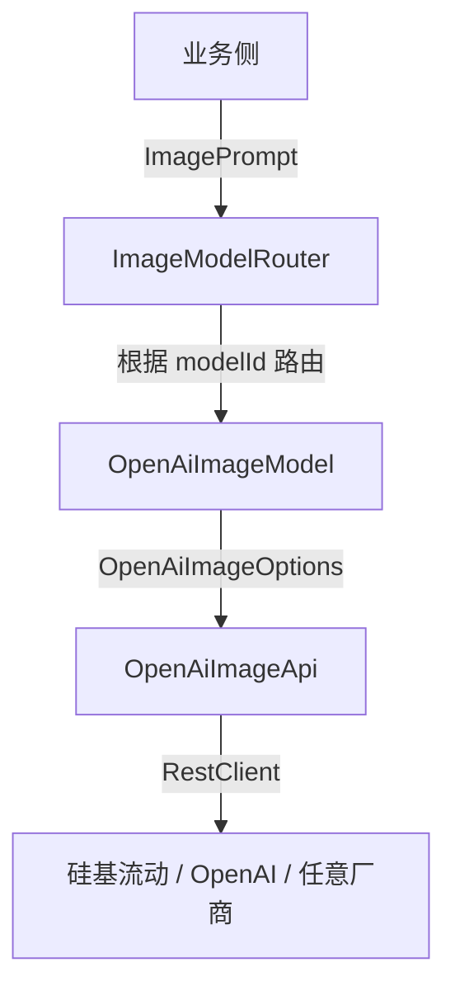

# spring-ai-image-extision
# 【精装修版】Spring AI 文生图 / 图生图 多模型集群实战指南

> 原文档沉淀于飞书（含完整源码、踩坑、架构演进）：  
> https://dcn7850oahi9.feishu.cn/docx/DDehdPBMSoGTycxmFTLcER4In0F?from=from_copylink  
> 本文档在飞书原文基础上进行「代码级精装修」——更简洁、可维护、可扩展，开箱即用。  
> 仓库地址（持续迭代）：`https://github.com/yutao-dev/spring-ai-image-extision`

---

## 1. 一图看懂架构


---

## 2. 核心扩展点
| 需求 | 做法 |
|---|---|
| 新增字段 | 在 `OpenAiImageOptions` 加字段 + `@JsonProperty` 即可，零侵入 |
| 字段白名单 | `limit-properties.{model-id}:[xxx,yyy]` 启动即校验 |
| 多厂商 | 新增 `FooImageApi` → 实现 `ImageModel` → 声明 `properties` |
| 异步 / 流式 | 内置 `ReactiveImageModel` 已提供，开关 `spring.ai.image.reactive=true` |

---

## 3. 高级玩法示例
### 3.1 图生图（带负面提示词）
```java
ImagePrompt prompt = ImagePrompt.builder()
        .messages(new ImageMessage("二次元少女"))
        .options(OpenAiImageOptions.builder()
                .image(ImageUtils.toDataUrl(new File("input.jpg")))
                .negativePrompt("低分辨率, 水印")
                .seed(42L)
                .build())
        .build();
```

### 3.2 动态切换模型 & 参数
```java
// 代码里临时覆盖任何参数
ImageModel model = imageModelMap.get("kolors");
OpenAiImageOptions override = OpenAiImageOptions.builder()
        .size("720x1280")
        .style("cinematic")
        .build();
ImageResponse resp = model.call(new ImagePrompt("赛博朋克城市", override));
```

---

## 4. 踩坑精华（必读）
1. **「模型不存在」** → 99% 是字段未同步到请求体，开启 `logging.level.com.your-org.image=DEBUG` 看真实报文。  
2. **「并发串行」** → 单账号 QPS 被限，横向扩容多账号 + 不同 `base-url` 即可。  
3. **「base64 被拒」** → 必须带 `data:image/png;base64,` 前缀，工具类 `ImageUtils` 已处理。  
4. **「大小写 404」** → 硅基流动模型名区分大小写，直接抄官方文档。

---
🔥 **Star 不走丢，后续持续推送更多模型集群干货！**
```
